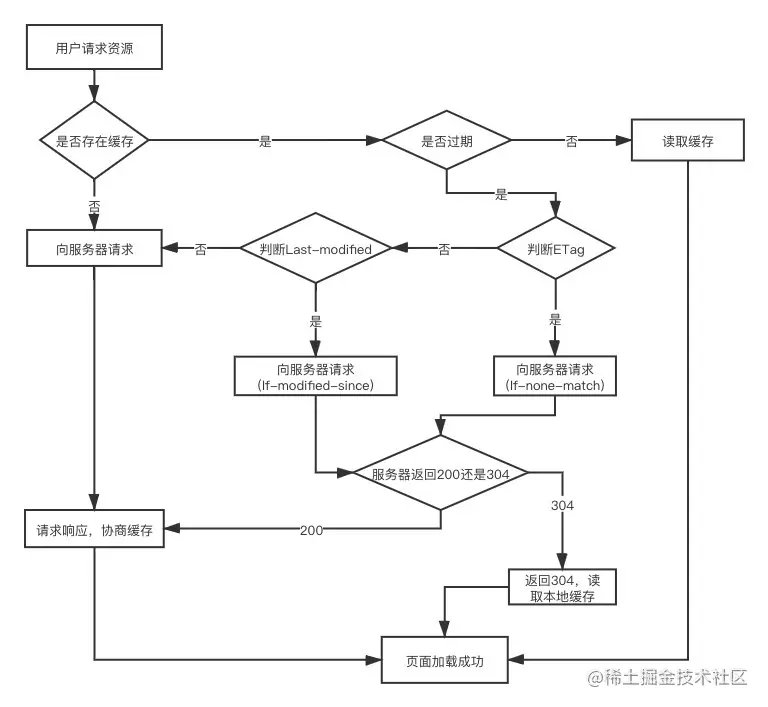
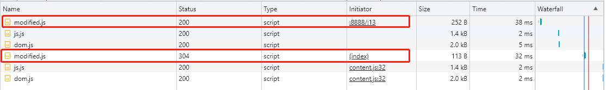
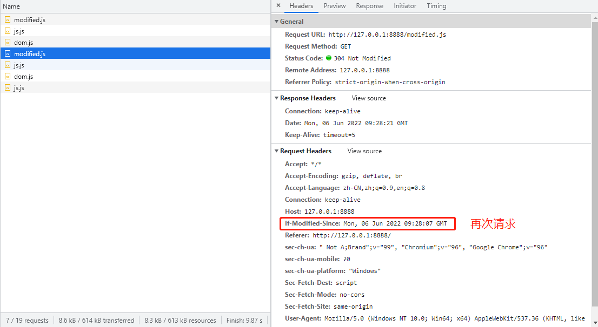
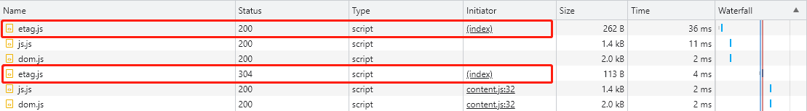
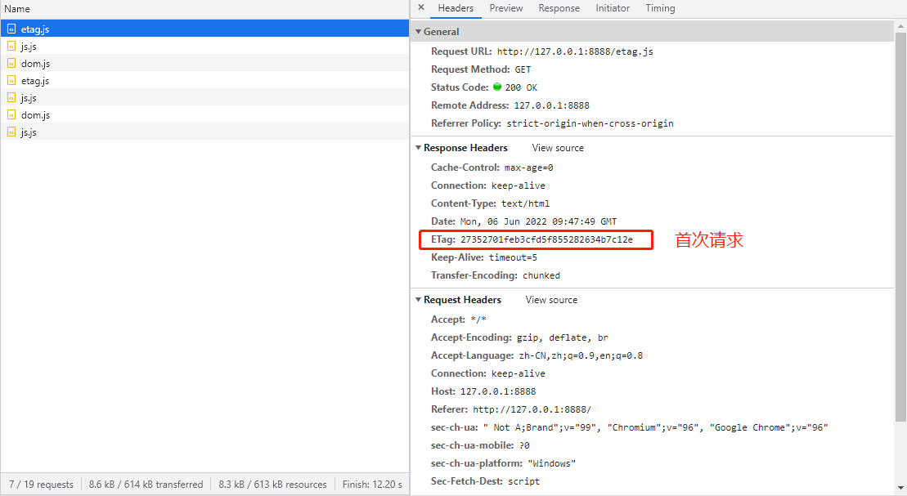
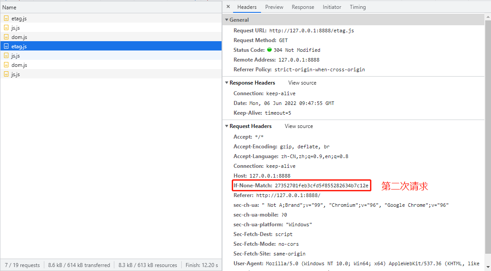

#### 协商缓存
>协商缓存就是强制缓存失效后，浏览器携带缓存标识向服务器发起请求，由服务器根据缓存标识决定是否使用缓存的过程。
(借鉴 ：https://juejin.cn/post/6935232082482298911)



#### 1.开启服务
```
node server.js
```

#### 2.页面查看
```
演示地址: http://127.0.0.1:8888/
```

#### 3.模拟Last-Modified
###### Last-Modified(响应头)，If-Modified-Since(请求头)

>在浏览器第一次给服务器发送请求后，服务器会在响应头中加上这个字段。浏览器接收到后，如果再次请求，会在请求头中携带If-Modified-Since字段，这个字段的值也就是服务器传来的最后修改时间。服务器拿到请求头中的If-Modified-Since的字段后，其实会和这个服务器中该资源的最后修改时间Last-Modified对比,询问服务器在该日期后资源是否有更新，有更新的话就会将新的资源发送回来。

>但是如果在本地打开缓存文件，就会造成 Last-Modified 被修改，所以在 HTTP / 1.1 出现了 ETag。

>注意多次测试 记得将目标 modified.js 内容更改，并且右键清除js游览器缓存 不然会游览器缓存(memory cache)





#### 4.模拟ETag
###### ETag(响应头)、If-None-Match(请求头)
>ETag是服务器根据当前文件的内容，给文件生成的唯一标识，只要里面的内容有改动，这个值就会变。服务器通过响应头把这个值给浏览器。浏览器接收到ETag的值，会在下次请求时，将这个值作为If-None-Match这个字段的内容，并放到请求头中，然后发给服务器。

>如果两种方式都支持的话，服务器会优先考虑ETag



