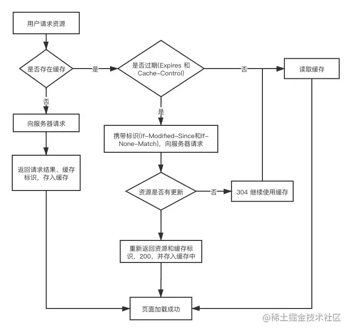
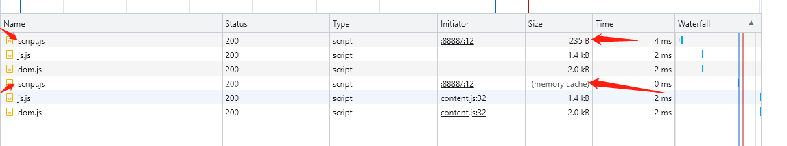

#### 强缓存
>强制缓存就是向浏览器缓存查找该请求结果，并根据该结果的缓存规则来决定是否使用该缓存结果的过程。强缓存又分为两种Expires和Cache-Control
(借鉴 ：https://juejin.cn/post/6935232082482298911)


#### Expires
- 版本：HTTP/1.0
- 来源：存在于服务端返回的响应头中
- 语法：Expires: Wed, 22 Nov 2019 08:41:00 GMT
- 缺点：服务器的时间和浏览器的时间可能并不一致导致失效

#### Cache-Control
- 版本：HTTP/1.1
- 来源：响应头和请求头
- 语法：Cache-Control:max-age=3600
- 缺点：时间最终还是会失效



#### 1.开启服务
```
node server.js
```

#### 2.页面查看
```
演示地址: http://127.0.0.1:8888/
```

#### 3.演示结果

